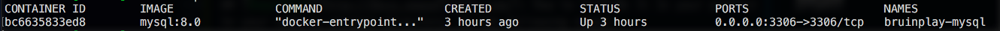

# Hackschool Learn Session 4: Relational Databases

## Table of Contents:
1. Logistics
2. Introduction to Docker
    - What is Docker?
    - Installation
3. Setting up MySQL
4. Sequelize
    - What is Sequelize?
    - How to use

### Logistics
**Location**: Covel 227

**Time:** 6:15 - 8:15

**Teachers:**

- Shannon Phu

**Slides:**

- [Session 4 - Relational Databases](https://docs.google.com/presentation/d/1vjVnIyq-kgLSYtG5BeMeocWSXk8OgCMgRpbjlzveod8/edit)

**Mentor Voting Form**:

- [Mentor Voting Form]\(TBD)

**Attendance Code:** TBD

**Course Overview Table of Contents**:

- [Course Schedule](https://github.com/acm-hackschool-f17/Resources/blob/master/README.md#basic-curriculum)

## What is Docker?

Docker is a tool that allows developers, sys-admins etc. to easily deploy their applications in a sandbox (called **containers**) to run on the host operating system, i.e. Linux. 

The key benefit of Docker is that it allows users to **package an application with all of its dependencies into a standardized unit** for software development. 

Unlike virtual machines, containers do not have the high overhead and hence enable more efficient usage of the underlying system and resources.

### What are containers?

The industry standard today is to use **Virtual Machines** (VMs) to run software applications. A VM simulates an operating system; it's kind of like a computer running as software inside another computer.

VMs are great at providing full process isolation for applications: there are very few ways a problem in the host operating system can affect the software running in the guest operating system, and vice-versa. But this isolation comes at great cost — the computational overhead spent virtualizing hardware for a guest OS to use is substantial.

Containers take a different approach: by leveraging the low-level mechanics of the host operating system, containers provide most of the isolation of virtual machines at a fraction of the computing power.

### Installing Docker

**On Mac:**

Click [here](https://www.docker.com/community-edition#/mac) and follow the instructions to download Docker.

**On Windows:**

Click [here](https://store.docker.com/editions/community/docker-ce-desktop-windows) and follow the instructions to download Docker.

#### Once Docker is installed:

Run Docker, then use your Terminal/Command Prompt to see if everything's set up. 

**On both Linux/Mac and Windows:**

```
$ docker version
```

This should output:

```
Client:
 Version:      17.09.0-ce
 API version:  1.32
 Go version:   go1.8.3
 Git commit:   afdb6d4
 Built:        Tue Sep 26 22:40:09 2017
 OS/Arch:      darwin/amd64

Server:
 Version:      17.09.0-ce
 API version:  1.32 (minimum version 1.12)
 Go version:   go1.8.3
 Git commit:   afdb6d4
 Built:        Tue Sep 26 22:45:38 2017
 OS/Arch:      linux/amd64
 Experimental: true
```

All set!

## Setting up MySQL
We'll be using Docker to run MySQL. 
### Steps:
1. Open up Terminal/Command Prompt
2. Run the following command which installs and starts running your database: 
    ```
    docker run --name bruinplay-mysql -p 3306:3306 -e MYSQL_ROOT_PASSWORD=my-secret-pw -d mysql:8.0
    ```
    You will see a long hash output, for example `bc6635833ed86be942067e0641df0bd3125447613e38c0b5cece9991f671c3ff`. The content of this text doesn't matter.
3. Type `docker ps`. Your Docker container should be running MySQL and you should see something like:
    

* To stop the database from running, type `docker stop bruinplay-mysql`
* To remove the container and uninstall MySQL in that container type `docker rm bruinplay-mysql` 

## [Sequelize](http://docs.sequelizejs.com/): How to include it in your project
In your node.js project directory, do the following steps:
1. Run `npm install mysql2 --save`
2. Run `npm install sequelize --save`
3. In your `server.js` or app entry point include sequelize
    ```
    const Sequelize = require('sequelize');
    ```
4. In `server.js` configure your node app to work with the currently running database connection
    ```
    const sequelize = new Sequelize('mysql', 'root', "my-secret-pw", {
        host: 'localhost',
        dialect: 'mysql'
    });
    ```
5. In `server.js` make the actual connection from your app to the database
    ```
    sequelize
        .authenticate()
        .then(function() {
            console.log('Connection has been established successfully.');
        })
        .catch(function(err) {
            console.error('Unable to connect to the database:', err);
        });
    ```
6. Start using Sequelize to create, read, update, or delete data in your MySQL database!
    * Docs: http://docs.sequelizejs.com/
